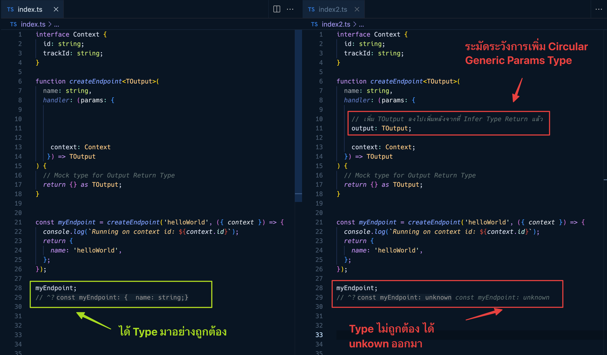

บทความนี้จะพาเราสู่โลกที่ลึกลับของ TypeScript และ Generic Params ที่ทำให้โปรแกรมเมอร์เราสามารถเขียนโค้ดที่ยืดหยุ่นและมีประสิทธิภาพได้มากยิ่งขึ้น! 🚀



## การใช้ Generic Params ใน TypeScript

ก่อนที่เราจะลุกไปเริ่มต้น มาเริ่มจากการเข้าใจหลักการของ Generic Params กันก่อนนะครับ ใน TypeScript, Generic Params จะช่วยให้เราสร้างโค้ดที่ใช้งานได้กับหลายประเภท โดยที่ไม่ต้องระบุประเภทนั้นๆ ในระหว่างการเขียนโค้ด

```typescript
function identity<T>(arg: T): T {
  return arg;
}
```
ในตัวอย่างนี้ `T` คือ Generic Param ที่เราสามารถใช้กับประเภทใดๆ ก็ได้ โดยที่ไม่ต้องระบุประเภทไว้ล่วงหน้า

ตัวอย่างการใช้งาน 

```typescript
// สร้างตัวแปรแบบ string
const stringValue = identity("Hello");
//     ^? const stringValue: "Hello"

// สร้างตัวแปรแบบ number
const numberValue = identity(42);
//     ^? const numberValue: 42    

// สร้างตัวแปรแบบ object
const objectValue = identity({ key: "value" });
//     ^? const objectValue: { key: string; }
```

---

## การ Infer Type ใน Function

โดยปกติแล้ว TypeScript สามารถ Infer Type จาก Function Type ได้ 

```typescript
interface Context {
  id: string;
  trackId: string;
}

function createEndpoint<TOutput>(
  name: string,
  handler: (params: {
    context: Context;
  }) => TOutput
) {
  // Mock type for Output Return Type
  return {} as TOutput;
}
```

เช่น ในตัวอย่างข้างบน
`handler` จะรับ parameter ที่เป็น handler ที่มี Type แบบนี้

```typescript
(params: { context: Context; }) => TOutput
```

โดยที่เมื่อผู้ใช้งานกำหนด Function ใน `handler` Return Type ของ `handler` ตัวนั้น ก็จะได้ Type ของ `TOutput` เหมือนกัน

ในตัวอย่างนี้ มีการส่ง function เข้าไปใน `handler` params โดยมี Return Type เป็น `{ name: string }`
ดังนั้น `createEndpoint` ก็สามารถ infer Type ออกมาได้เหมือนกับ Return Type ของ `handler` เช่นเดียวกัน

```typescript
const myEndpoint = createEndpoint('helloWorld', ({ context }) => {
  console.log(`Running on context id: ${context.id}`);
  return {
    name: 'helloWorld',
  };
});
```

เมื่อเราเช็ค Type ของ `myEndpoint` ดูก็พบว่า Type จะตรงกับ Return Type กับ Handler เลย

```typescript
myEndpoint
// ^? const myEndpoint: {
//     name: string;
// }
```

## การเรียกใช้งานแบบ Circular

แต่มีข้อควรระวังในการใช้ Generic Params เวลาที่เราเรียกใช้งานแบบ Circular เช่นตัวอย่างนี้ `TOutput` เป็น Generic Params ที่จะ Infer Type มาจาก Return Type ของ `handler` ออกมา

ตัวอย่างการเรียก Generic Params แบบ Circular

```typescript
function createEndpoint<TOutput>(
  name: string,
  handler: (params: {
    // เพิ่ม TOutput ลงไปเพิ่มหลังจากที่ Infer Type Return แล้ว
    output: TOutput;
    context: Context;
  }) => TOutput
) {
  // Mock type for Output Return Type
  return {} as TOutput;
}

//... const myEndpoint = createEndpoint(...)

myEndpoint
// ^? const myEndpoint: unknown
```

โดยที่เมื่อเราพยายามใส่ `TOutput` ลงไปใน Type ของ `handler` ที่แท้จริงแล้ว Type จะมาจาก Return Type แล้ว Infer ออกมา แต่กลับ มีการเรียก Type Infer จาก Params ของ `handler` ด้วย กลับกลายเป็นว่า TypeScript ไม่สามารถคาดเดา Type ที่ถูกต้องกันได้ เพราะต่างฝ่ายต่างเรียกหากันเอง จึงทำให้ `myEndpoint` มีค่าเป็น `unknown` ไปเลย

หวังว่าจะเป็นประโยชน์นะครับ แล้วพบกันใหม่ สวัสดีครับ

